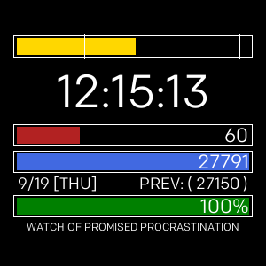

# CHFace

## Custom face for Fitbit Versa

A custom watch face for my personal use that is unimaginatively named CHFace for unique identification.
As every watch face I found had either too much or too little information, I created this one with exactly what I want.

As it is meant for my personal use, it currently has very little in the way of customisation options and way too much
in the way of hardcoded values, which is an extension I may or may not pursue in the future. (Sincerely, I hate JS, SVG
and all this markup stuff.)

## Face features

1. Simple digital clock with seconds
2. Time bar representing how far in the day the current time is with vertical bars representing my sleep goal (7 am and 11 pm)
3. HR with bar maxed at 220
4. Steps with bar maxed at 10000, then overcharge once to 15000 and once again to 20000
5. Battery meter

## Fitbit link

The gallery link for downloading this face can be found [here](https://gallery.fitbit.com/details/02bf9edd-e317-428f-9eff-59ffb9b31dbf).
